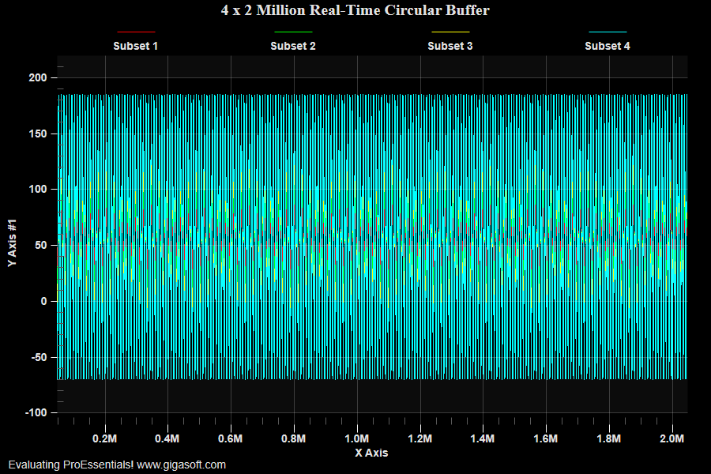

# ProEssentials WPF Real-Time Circular Buffer — 4 x 2 Million Points

A ProEssentials v10 WPF .NET 8 demonstration of the highest-performance
real-time line charting pattern using PesgoWpf — combining local-memory
`UseDataAtLocation`, v10 `CircularBuffers`, GPU `ComputeShader` with
`StagingBuffers`, and `Filter2D3D` data reduction to sustain a continuous
**8 million float** real-time update at 15ms intervals without frame drops.

Extends the base example 146 pattern with a **custom right-click Zoom Mode
menu** that lets you switch live between two zooming behaviors — demonstrating
the single-line timer tick difference between examples 145 and 146.



➡️ [gigasoft.com/examples/146](https://gigasoft.com/examples/146)

---

## What This Demonstrates

**4 subsets × 2,000,000 points = 8,000,000 floats** updated continuously at
150 new samples per subset every 15ms. The chart never allocates new memory,
never shifts existing data, and the GPU never waits on a CPU copy — achieving
the maximum throughput possible in a .NET WPF application.

---

## The Two Zoom Modes (right-click → Zoom Mode)

This repo combines examples 145 and 146 into a single app, toggling between
their zoom behaviors via the custom right-click menu. The subtitle updates
to reflect the active mode.

### Stationary (default — example 146 behavior)

```
Zoom in → zoom window stays fixed
New data streams past behind it
```

When zoomed in, the zoom window does **not** advance. New data continuously
appends to the ring buffer and updates the full axis extents, but the
zoomed viewport is anchored in time. Use this to study a feature in detail
while the live stream keeps running.

### Scrolling (example 145 behavior)

```
Zoom in → zoom window follows the latest samples
```

When zoomed in, `Zoom.MaxX` and `Zoom.MinX` are each advanced by
`nNewSamplesPerTick` every frame. The viewport "follows" the data stream,
always showing the most recent 150 samples per tick.

### The Entire Code Difference

```csharp
// In Timer_Tick — the only difference between 145 and 146:

if (_zoomScrolls && Pesgo1.PeGrid.Zoom.Mode)  // Scrolling mode (145)
{
    Pesgo1.PeGrid.Zoom.MaxX += nNew;
    Pesgo1.PeGrid.Zoom.MinX += nNew;
}
// Comment out the block above = Stationary mode (146)
```

---

## ProEssentials Features Demonstrated

### UseDataAtLocation — Zero-Copy Local Memory

```csharp
// App owns these arrays — chart holds a pointer, never copies them
private readonly float[] _xData = new float[2_000_000];
private readonly float[] _yData = new float[8_000_000];

// Give the chart direct access — no transfer, no allocation
Pesgo1.PeData.X.UseDataAtLocation(_xData, 2_000_000);
Pesgo1.PeData.Y.UseDataAtLocation(_yData, 8_000_000);
```

Compare to example 145 which uses `FastCopyFrom` — that copies 8M floats
into chart-internal circular buffers at init time. `UseDataAtLocation` is
faster because the GPU staging buffers read from your memory directly.
No copy ever happens between app memory and chart memory.

### CircularBuffers (v10)

```csharp
Pesgo1.PeData.CircularBuffers = true;  // set before UseDataAtLocation
```

`AppendData` writes into a ring buffer rather than shifting all existing data
left. With 2M points per subset, shifting without `CircularBuffers` would move
8M floats every 15ms. With it, append is O(1) — only the new samples are
written. `ComputeShader` rendering reads the ring in-order with no penalty.

### DuplicateDataX — Single X Array for All Subsets

```csharp
Pesgo1.PeData.DuplicateDataX = DuplicateData.PointIncrement;
// ...
Pesgo1.PeData.X.UseDataAtLocation(_xData, 2_000_000);  // one array, not four
```

One shared X array instead of 4 × 2M = 8M floats of redundant X data. The
chart uses `_xData[p]` for all subsets automatically. AppendData on X sends
only 150 values per tick instead of 600.

### GPU Pipeline — ComputeShader + StagingBuffers + Filter2D3D

```csharp
Pesgo1.PeConfigure.RenderEngine = RenderEngine.Direct3D;
Pesgo1.PeData.ComputeShader     = true;  // geometry built on GPU
Pesgo1.PeData.StagingBufferX    = true;  // DX CPU→GPU transfer path for X
Pesgo1.PeData.StagingBufferY    = true;  // DX CPU→GPU transfer path for Y
Pesgo1.PeData.Filter2D3D        = true;  // lossless pixel-level reduction
Pesgo1.PeSpecial.AutoImageReset = false; // suppress intermediate redraws
```

At 2M points per subset, only ~1000 points are visible per pixel-column at
any zoom level. `Filter2D3D` applies a lossless min/max reduction before GPU
transfer — the GPU only processes the visible data density, not the full 2M.
`AutoImageReset = false` suppresses WPF's intermediate invalidation path,
preventing tearing at 67fps update rates.

### Manual Axis Scaling — Skip the Min/Max Scan

```csharp
Pesgo1.PeGrid.Configure.ManualScaleControlY = ManualScaleControl.MinMax;
Pesgo1.PeGrid.Configure.ManualMinY          = -110;
Pesgo1.PeGrid.Configure.ManualMaxY          =  220;

Pesgo1.PeGrid.Configure.ManualScaleControlX = ManualScaleControl.MinMax;
Pesgo1.PeGrid.Configure.ManualMinX          = 0;
Pesgo1.PeGrid.Configure.ManualMaxX          = 2_000_000;
```

Without manual scaling the chart scans all 8M floats every tick to find
min/max. With manual scaling that scan is skipped entirely — the axis extents
are updated manually in the timer tick as the counter advances.

### Custom Right-Click Menu — PeCustomMenu Event (example 127 pattern)

```csharp
// Define menu items — "|" prefix = separator, "Title|Sub1|Sub2" = submenu
Pesgo1.PeUserInterface.Menu.CustomMenuText[0] = "|";
Pesgo1.PeUserInterface.Menu.CustomMenuText[1] = "Zoom Mode|Stationary|Scrolling";

// Default: Stationary checked
Pesgo1.PeUserInterface.Menu.CustomMenuState[1, 1] = CustomMenuState.Checked;
Pesgo1.PeUserInterface.Menu.CustomMenuState[1, 2] = CustomMenuState.UnChecked;

// Both items placed at bottom of built-in menu
Pesgo1.PeUserInterface.Menu.CustomMenuLocation[0] = CustomMenuLocation.Bottom;
Pesgo1.PeUserInterface.Menu.CustomMenuLocation[1] = CustomMenuLocation.Bottom;
```

```csharp
// Wire the event:
Pesgo1.PeCustomMenu += Pesgo1_PeCustomMenu;

// Handler — radio-style mutual exclusion:
private void Pesgo1_PeCustomMenu(object sender,
    Gigasoft.ProEssentials.EventArg.CustomMenuEventArgs e)
{
    if (e.MenuIndex != 1) return;

    Pesgo1.PeUserInterface.Menu.CustomMenuState[1, 1] = CustomMenuState.UnChecked;
    Pesgo1.PeUserInterface.Menu.CustomMenuState[1, 2] = CustomMenuState.UnChecked;
    Pesgo1.PeUserInterface.Menu.CustomMenuState[1, e.SubmenuIndex] = CustomMenuState.Checked;

    _zoomScrolls = (e.SubmenuIndex == 2);
}
```

---

## Y Data Memory Layout

The `_yData` array is a flat interleaved block, subset-major order:

```
[0       .. 1999999]   subset 0  (red)
[2000000 .. 3999999]   subset 1  (green)
[4000000 .. 5999999]   subset 2  (yellow)
[6000000 .. 7999999]   subset 3  (cyan)
```

`UseDataAtLocation(_yData, 8_000_000)` passes the total element count.
`AppendData(_newY, 150)` appends 150 samples per subset per tick, laid out
the same way: `[s0p0..s0p149 | s1p0..s1p149 | s2.. | s3..]`.

---

## Controls

| Input | Action |
|-------|--------|
| Mouse wheel | Horizontal zoom in / out |
| Right-click | Context menu |
| Right-click → Zoom Mode → Stationary | Zoom window fixed (default) |
| Right-click → Zoom Mode → Scrolling | Zoom window follows data |

---

## Prerequisites

- Visual Studio 2022
- .NET 8 SDK
- Internet connection for NuGet restore
- Discrete GPU recommended (integrated GPU will work but may throttle)

---

## How to Run

```
1. Clone this repository
2. Open RealTimeCircularBuffer.sln in Visual Studio 2022
3. Build → Rebuild Solution (NuGet restore is automatic)
4. Press F5
5. Mouse-wheel to zoom in, then right-click → Zoom Mode to switch behaviors
```

---

## NuGet Package

References
[`ProEssentials.Chart.Net80.x64.Wpf`](https://www.nuget.org/packages/ProEssentials.Chart.Net80.x64.Wpf).
Package restore is automatic on build.

---

## Related Examples

- [WPF Delaunay 2D Contour — Example 147](https://github.com/GigasoftInc/wpf-chart-delaunay-triangulation-contour-proessentials)
- [WPF 3D Delaunay Heightmap — Example 414](https://github.com/GigasoftInc/wpf-3d-delaunay-heightmap-point-cloud-proessentials)
- [WPF Heatmap Spectrogram — Example 139](https://github.com/GigasoftInc/wpf-chart-heatmap-spectrogram-proessentials)
- [WPF Quickstart — Simple Scientific Graph](https://github.com/GigasoftInc/wpf-chart-quickstart-proessentials)
- [All Examples — GigasoftInc on GitHub](https://github.com/GigasoftInc)
- [Full Evaluation Download](https://gigasoft.com/net-chart-component-wpf-winforms-download)
- [gigasoft.com](https://gigasoft.com)

---

## License

Example code is MIT licensed. ProEssentials requires a commercial
license for continued use.
